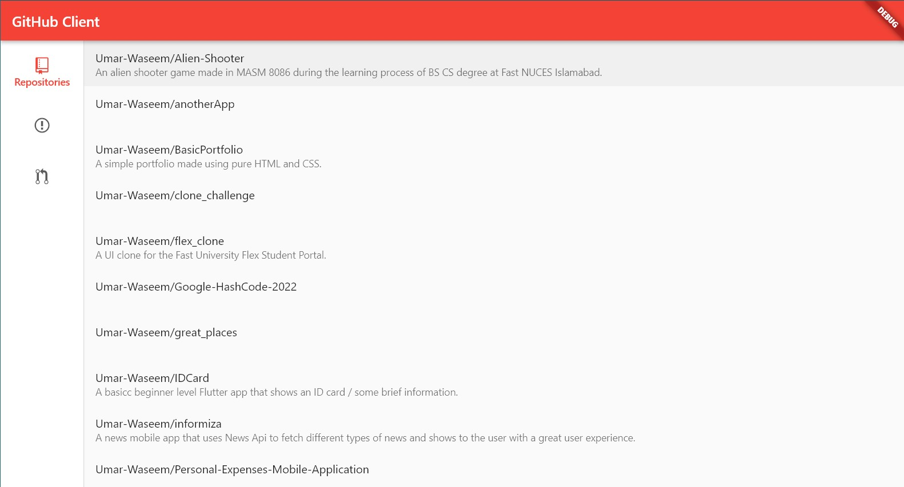

# Github_Client

A github, web and windows client app made simultaneously with one code-base using the amazing flutter.

# Faetures

Displays all your Repos, Issues and PR's after authenticating using OAUTH2.

Made by following the flutter desktop codelab :
`` https://codelabs.developers.google.com/codelabs/flutter-github-client#0  ``

## Screenshot

